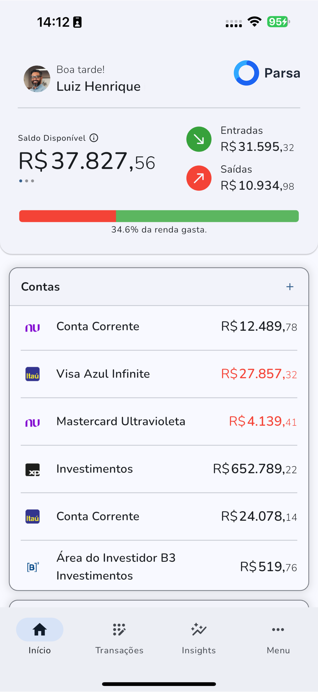
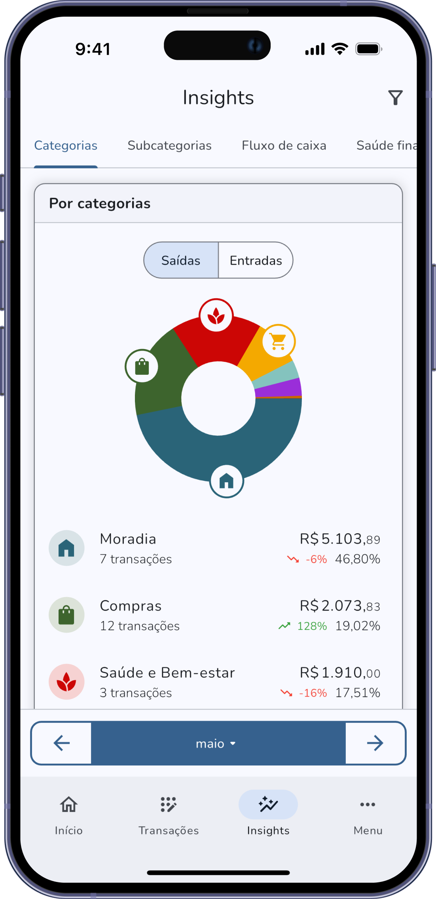
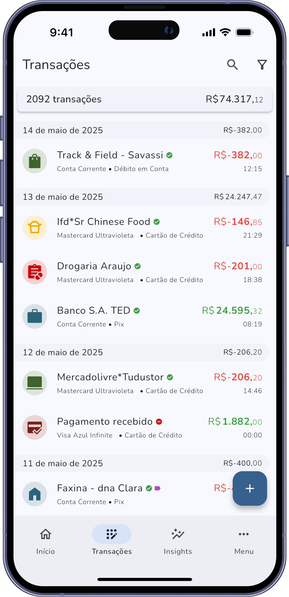
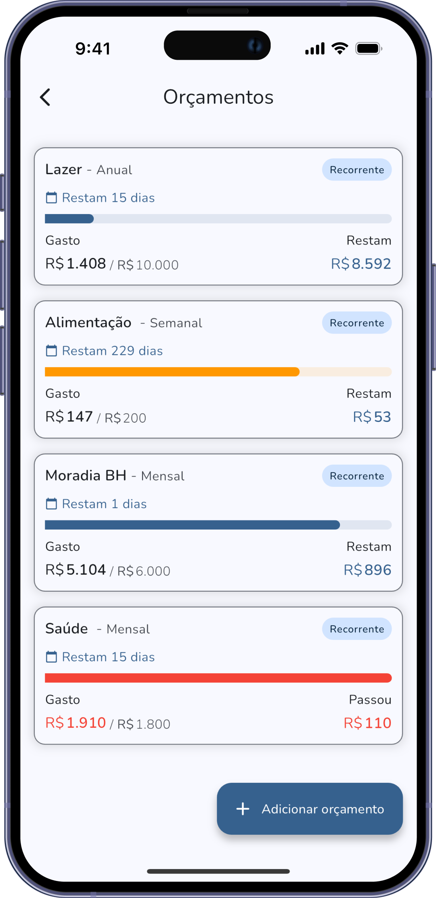

# Parsa

**A PFM for the Open Finance era.**

A Personal Finance Manager built around bank connectivity, not manual input.

**Live in production since December 2024** — available on [App Store](https://apps.apple.com/sa/app/parsa/id6736430673) and [Google Play](https://play.google.com/store/apps/details?id=com.parsa.app&hl=pt_BR).

<!-- Screenshots -->
<p align="center">
  
  &nbsp;
  
  &nbsp;
  
  &nbsp;
  
</p>

---

## Repositories

| Repo | Description |
|------|-------------|
| **parsa-mobile** (this repo) | Flutter client — UI, offline storage, Open Finance consent flow |
| [parsa-go](https://github.com/lazaroborges/parsa-go) | Core backend API — authentication, cloud sync, and data persistence |
---

## About

Parsa is an Open Finance-first Personal Finance Manager (PFM) built with Flutter. Rather than asking users to manually log every transaction, Parsa connects to bank accounts via Open Finance APIs and automatically imports data — then enriches it with budgets, analytics, and smart categorization.

The app launched in Brazil, where Open Finance is a regulated, standardized infrastructure (similar to Plaid in the USA, Open Banking in the UK or PSD2 in Europe), making it a natural fit. The architecture, however, is built to be market-agnostic: swap the Open Banking connector consent flow and the approach applies anywhere.

This project was forked from [Monekin](https://github.com/enrique-lozano/Monekin/) at release version 7.0.0. Monekin is an excellent local-first, open-source finance tracker — Parsa takes that foundation in a different direction: connectivity-first, cloud-synced, and built around the idea that a PFM should know your finances before you tell it anything, striving toward zero manual input.

### What changed from Monekin

Parsa diverged significantly from the original Monekin codebase:

- **Open Finance integration** — Bank account connection via [Pluggy](https://pluggy.ai/) consent flows. The connector is provider-agnostic — Pluggy, Belvo, Celcoin, or Plaid can be swapped in depending on the target market
- **Server-backed architecture** — Monekin was local-only with SQLite backups. Parsa adds backend authentication (email/password + Google/Apple OAuth), cloud sync, and long-term data persistence via server APIs
- **FCM event bus** — Firebase Cloud Messaging repurposed as an event bus: server-side data changes push an FCM notification that triggers the client to pull updates, avoiding polling
- **Counterparty-first classification** — A "cousin" system that identifies transaction counterparties and uses them as the primary method of categorization, auto-suggesting categories for new transactions
- **Firebase & Sentry** — Full observability stack with Firebase Analytics, Firebase In-App Messaging, FCM for push notifications, and Sentry for error tracking
- **Branch deep linking** — Deep link support for user acquisition and navigation
- **In-app purchase subscriptions** — Monetization via subscription model
- **Brazilian market focus** — Locked to Portuguese, with BRL as the default currency and São Paulo timezone. The localization infrastructure (Slang) supports other languages, but some strings might have been hardcoded in Portuguese throughout the codebase

## Features

- **Bank integration** — Connect Brazilian bank accounts via Open Finance
- **Transaction tracking** — Income, expenses, and transfers with recurrence support
- **Budgets** — Category, account, or tag-based budgets with flexible periods
- **Analytics** — Charts and insights into spending patterns
- **Multi-currency** — ISO 4217 currency support with exchange rates
- **Categories & tags** — Hierarchical categories with custom icons and transaction tagging
- **Offline-first** — Full functionality offline with background cloud sync
- **Responsive** — Adapts to phone, tablet, and desktop layouts
- **Biometric auth** — Fingerprint/Face ID lock
- **CSV export** — Export transaction data
- **Push notifications** — Budget alerts and transaction reminders

## Tech Stack

| Layer | Technology |
|-------|-----------|
| Framework | Flutter (3.22.3+) / Dart (3.0+) |
| Database | SQLite via [Drift](https://drift.simonbinder.eu/) ORM |
| State management | [Provider](https://pub.dev/packages/provider) |
| Navigation | [Go Router](https://pub.dev/packages/go_router) |
| Auth | Backend API + OAuth (Google/Apple) |
| Open Finance | [Pluggy](https://pluggy.ai/) (replaceable) |
| Push notifications | Firebase Cloud Messaging |
| Error tracking | [Sentry](https://sentry.io/) |
| Deep linking | [Branch](https://branch.io/) |
| Charts | [fl_chart](https://pub.dev/packages/fl_chart) |
| i18n | [Slang](https://pub.dev/packages/slang) |
| Payments | In-App Purchase (iOS & Android) |

## Project Structure

```
lib/
├── app/                    # Feature modules
│   ├── accounts/           # Bank accounts & Open Finance connector
│   ├── transactions/       # Income/expense/transfer management
│   ├── budgets/            # Budget tracking
│   ├── categories/         # Hierarchical categories
│   ├── stats/              # Analytics & charts
│   ├── home/               # Dashboard
│   ├── tags/               # Transaction tags
│   ├── currencies/         # Multi-currency support
│   ├── notifications/      # Push notification handling
│   ├── settings/           # User preferences
│   ├── onboarding/         # First-run setup
│   └── layout/             # Responsive navigation shell
├── core/
│   ├── api/                # Server communication (fetch, post, delete)
│   ├── database/           # Drift ORM, services, queries, backups
│   ├── models/             # Data models (account, transaction, budget, etc.)
│   ├── services/           # Auth, notifications, session, finance health
│   ├── providers/          # Provider state management
│   ├── presentation/       # Theme, colors, responsive breakpoints, widgets
│   ├── routes/             # Go Router config & destinations
│   ├── extensions/         # Dart extensions
│   └── utils/              # Helpers
├── i18n/                   # Slang translation files (Portuguese)
└── main.dart               # Entry point
```

## Getting Started

### Prerequisites

- Flutter SDK >= 3.22.3
- Dart SDK >= 3.0.0
- Xcode (for iOS)
- Android Studio (for Android)

### Setup

```bash
# Clone the repository
git clone https://github.com/lazaroborges/parsa.git
cd parsa

# Install dependencies
flutter pub get

# Create environment file
cp .env.example .env
# Edit .env with your configuration (API endpoint, Auth0, Pluggy, etc.)

# Run code generation
dart run build_runner build --delete-conflicting-outputs
dart run slang

# Run the app
flutter run
```

### Environment Variables

The app uses a `.env` file for configuration. Key variables include:

- API endpoint URL
- Auth0 credentials
- Pluggy API keys
- Firebase configuration
- Sentry DSN
- Branch keys

### Database

Parsa uses Drift (SQLite) for local storage. The database is recreated from scratch on each app version — there are no incremental migrations between releases. You can edit models and the latest migration file directly.

Migration files live in `assets/sql/migrations/`.

## Development

```bash
# Run with hot reload
flutter run

# Run code generation (after model changes)
dart run build_runner build --delete-conflicting-outputs

# Regenerate translations
dart run slang

# Regenerate app icons
dart run flutter_launcher_icons

# Run tests
flutter test

# Analyze code
flutter analyze

# Auto-fix lint issues
dart fix --apply

# Full clean
flutter clean
```

## Architecture

### Offline-First with Cloud Sync

All data is stored locally in SQLite via Drift. The app works fully offline. When connectivity is available, data syncs with the backend API. Firebase Cloud Messaging acts as an event bus — when server-side data changes, an FCM push triggers the app to pull updates.

### Counterparty Classification (Cousins)

When a new transaction is created, Parsa checks for similar counterparties ("cousins") in existing transactions. If a match is found, the app suggests the same category, reducing manual categorization effort over time.

### Open Finance Integration

Bank account connectivity is handled through Pluggy's consent flow. The integration is designed to be provider-agnostic — Pluggy was chosen because it offered a Flutter SDK, though the current implementation uses their web-based consent flow. Other Brazilian or Global Open Banking (like Plaid in the US and Europe) providers can be used. 

### Responsive Layout

The app adapts to different screen sizes using a custom breakpoint system:
- **Mobile** — Bottom navigation bar
- **Tablet** — Multi-column layout
- **Desktop** — Sidebar navigation

## Contributing

PRs are welcome. Fork, branch, and open a pull request. Run `flutter test` and `flutter analyze` before submitting. If you changed models, run `dart run build_runner build --delete-conflicting-outputs`.

Good first contributions:

- Extracting hardcoded Portuguese strings into the Slang i18n system (Issue #50)
- Adding language support beyond Portuguese
- Test coverage (unit, widget, integration)
- Accessibility improvements

## License

This project is licensed under the **GNU Affero General Public License v3.0 (AGPL-3.0)** — see the [LICENSE](LICENSE) file for details.

Forked from [Monekin](https://github.com/enrique-lozano/Monekin/) which is also AGPL-3.0 licensed.

## Acknowledgments

- [Monekin](https://github.com/enrique-lozano/Monekin/) by Enrique Lozano — the foundation this project was built on
- [Pluggy](https://pluggy.ai/) — Open Finance infrastructure for Brazil
- [@Vitordoce](https://github.com/Vitordoce) — early development contributor
